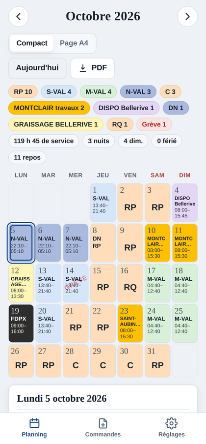
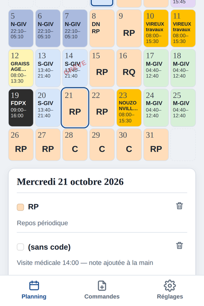
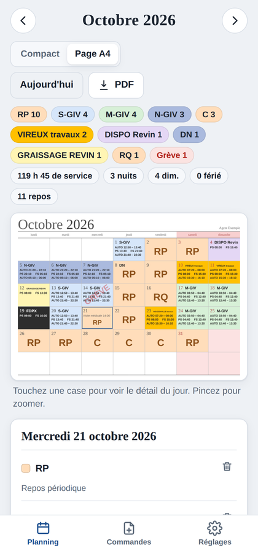
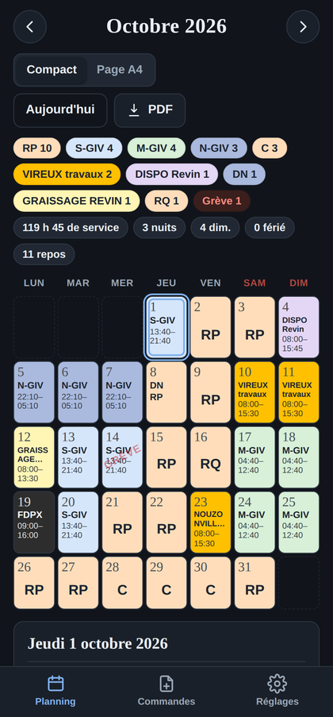
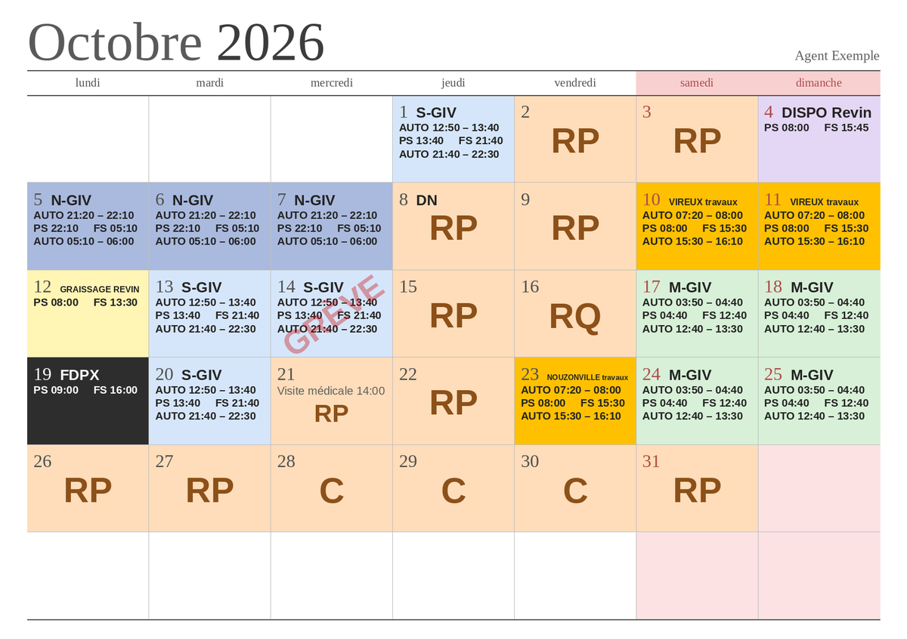
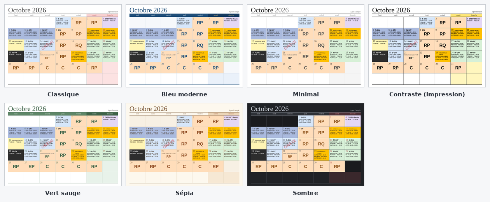
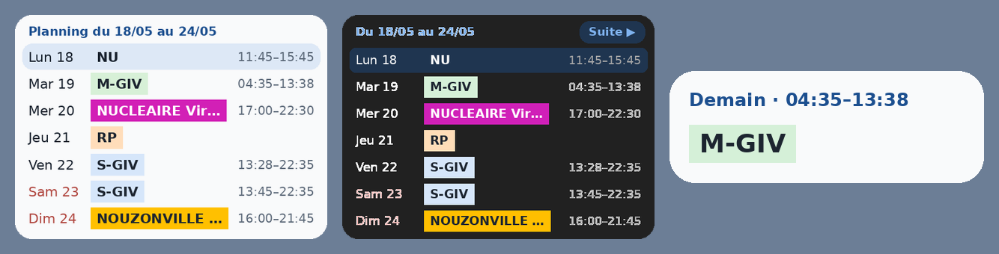
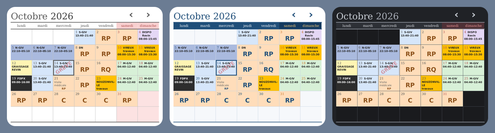

# Planning Commandes

**Vos bulletins de commande deviennent un planning clair, en couleurs, sur le téléphone et sur le PC.**

Chaque semaine arrive un nouveau *bulletin de commande* en PDF : un long tableau de codes (GIV001, RP, ZREVIN…) et d'horaires (« AUTO 03:50 – 04:40 / PS 04:40 / FS 12:40… »), difficile à lire d'un coup d'œil. Planning Commandes lit ces PDF et en fait **un calendrier du mois** :

- chaque jour affiche **le service sous un nom parlant** (M-GIV, S-GIV, DISPO Revin…), **dans sa couleur**, avec les **heures de prise et de fin de service** ;
- ajoutez les bulletins au fil des semaines : pour chaque jour, **le plus récent l'emporte**, et l'application liste **ce qui a changé** (« Mer 21/10 : S-GIV → RP ») ;
- le mois se lit d'un regard : **repos en gros**, nuits et **lendemains de nuit (DN)**, **jours fériés**, **grèves** en filigrane, et un récapitulatif (**heures de service, nuits, dimanches et fériés travaillés, repos**).

Il existe en deux versions qui lisent les bulletins exactement de la même façon :

| | 📱 Application Android | 💻 Programme PC (Windows) |
|---|---|---|
| Fichier | `PlanningCommandes.apk` | `PlanningPDF.exe` |
| En plus | widgets pour l'écran d'accueil, « Partager » un bulletin depuis un mail | dossier `commande` lu automatiquement, sauvegardes automatiques |
| Données | dans le téléphone | sur le PC |

Pas de compte, pas d'abonnement, **pas de données envoyées sur Internet**. Un PDF créé par une version se rouvre dans l'autre.

> Les captures ci-dessous montrent un **planning fictif** (« Agent Exemple »).

---

## 📸 Aperçu

### Sur le téléphone

<table>
  <tr>
    <td align="center"><br><sub>Le mois en un coup d'œil</sub></td>
    <td align="center"><br><sub>Détail d'un jour, notes</sub></td>
    <td align="center"><br><sub>Vue « page A4 » (= le PDF)</sub></td>
    <td align="center"><br><sub>Thème sombre du téléphone</sub></td>
  </tr>
</table>

### Sur le PC



*Le planning tel que le programme PC le dessine : c'est la même image à l'écran, dans le PDF et à l'impression (une page A4 paysage par mois).*

### 7 thèmes, à l'écran comme dans le PDF



### Widgets de l'écran d'accueil



*« Planning » (style d'origine ou GrapheneOS, 7 ou 14 jours) et « Prochain service » (aperçus dessinés).*



*« Calendrier du mois » : la page du PDF sur l'écran d'accueil, au thème du planning (ici Classique, Bleu moderne, Sombre).*

---

## ✨ Ce que fait l'application

**Lire les commandes**
- Import d'un ou plusieurs bulletins PDF (Android : bouton **Ajouter une commande**, ou **Partager / Ouvrir avec** depuis un mail ; PC : déposer les PDF dans le dossier `commande`).
- Fusion intelligente : le bulletin le plus récent l'emporte jour par jour ; les notes ajoutées à la main sont conservées.
- Liste des jours modifiés par une nouvelle commande.

**Lire le planning**
- Grille compacte ou page A4, mois précédent / suivant d'un glissement de doigt.
- Codes renommés et colorés à votre goût (éditeur **Codes et couleurs**), repos en gros, « DN » ajouté automatiquement après une série de nuits.
- Jours fériés (Pâques, Ascension, Pentecôte calculés), jours de grève, notes personnelles.
- Récapitulatif du mois : heures de service, nuits, dimanches et fériés travaillés, repos.

**Garder, partager, imprimer**
- **PDF** du planning (A4 paysage, un mois par page) à enregistrer ou **imprimer**.
- **Export vers l'agenda** (.ics) : un rendez-vous par service dans Google Agenda, Outlook ou l'agenda du téléphone.
- **Échange PC ↔ téléphone** et copies de sauvegarde.

**Au quotidien sur Android**
- **Apparence GrapheneOS** (Réglages) : toute l'application aux couleurs de GrapheneOS (anthracite, blanc cassé, bleu, toujours en sombre), barres du téléphone comprises. Sinon, elle suit le thème clair ou sombre du téléphone.
- **Widget « Planning »** : une ligne par jour, le service en couleur ; réglé à la pose (style d'origine ou **GrapheneOS**, horaires, **7 ou 14 jours**), il s'adapte à sa taille. Toucher un jour l'ouvre dans l'application.
- **Widget « Calendrier du mois »** : la grille du PDF sur l'écran d'accueil, au thème du planning, jour J encadré, **‹ ›** pour changer de mois.
- **Widget « Prochain service »** (2 × 1) : « Demain · 04:40–12:40 » et le service en couleur ; une nuit reste « En cours » jusqu'au matin.
- Les widgets changent de jour tout seuls, même téléphone en veille ou après un redémarrage.

**Toujours à jour**
- Une fois par jour, l'application et l'exe regardent la page **Releases** de ce dépôt. S'il y a une nouvelle version, ils proposent de **la télécharger et l'installer** sans passer par le navigateur. Le planning est conservé.

---

## 📲 Installer sur le téléphone

1. Sur le téléphone, ouvrez **[Releases → dernière version](../../releases/latest)**.
2. Touchez **`PlanningCommandes.apk`**, puis ouvrez le fichier téléchargé.
3. Autorisez l'installation depuis cette source si Android le demande, puis **Installer**.
4. Si Play Protect signale une « appli inconnue » (normal hors Play Store) : **Plus de détails → Installer quand même**.

Android 7.0 ou plus récent. Les versions suivantes se proposent toutes seules (bandeau **Installer**, ou **Réglages → Mise à jour de l'application**).

## 💻 Installer sur le PC

1. Ouvrez **[Releases → exe](../../releases/tag/exe)** et téléchargez **`PlanningPDF.exe`**.
2. Placez-le dans un dossier à vous (par exemple `Documents\PlanningPDF`) et double-cliquez dessus. Si Windows affiche « Windows a protégé votre ordinateur » : **Informations complémentaires → Exécuter quand même**.

Les versions suivantes se proposent toutes seules (ou **Aide → Rechercher une mise à jour…**) : l'exe se remplace à la fermeture et se relance.

---

## 💾 Vos données

- Le planning reste **sur l'appareil** : rien n'est envoyé sur Internet. La seule connexion sert à lire, une fois par jour, le numéro de la dernière version publiée ici.
- **Désinstaller l'application efface le planning** : faites de temps en temps **Réglages → Sauvegarde → Enregistrer une copie**, et « Reprendre une copie… » pour la restaurer. L'application vous le rappelle.
- Ce dépôt ne contient que le code, aucune donnée personnelle.

---

## 🛠️ Fabrication (pour information)

À chaque envoi de fichiers, GitHub Actions (`.github/workflows/apk.yml`) fabrique et publie :

- **l'APK** (release `apk`) : Gradle 8.7, Android Gradle Plugin 8.5, Java 17, `compileSdk` 34, `minSdk` 24 ; numéro de version = numéro de fabrication ; signé avec `app/planning.keystore` ;
- **l'exe Windows** (release `exe`) : Python 3.12 + PyInstaller à partir de `pc/planning_pdf.py` et `pc/regles.json`.

Chaque release contient aussi `version.json`, lu par la mise à jour automatique.

> ⚠️ Ne supprimez pas `app/planning.keystore` : sans cette clé, une nouvelle version ne pourrait plus s'installer par-dessus l'ancienne.

```
app/
├── build.gradle                      configuration Android, signature, numéro de version
├── planning.keystore                 clé de signature (à conserver)
└── src/main/
    ├── AndroidManifest.xml
    ├── java/fr/planning/commandes/   fenêtre de l'appli, widgets, mise à jour automatique
    ├── assets/index.html             l'application (lecture des bulletins, planning, réglages)
    ├── assets/lib/                   pdf.js (lecture des PDF) et pdf-lib (création des PDF)
    └── res/                          icône, thèmes, widgets
pc/
├── planning_pdf.py                   programme PC
└── regles.json                       règles communes PC / mobile (codes de repos, couleurs, thèmes)
docs/captures/                        images de ce README
```

Bibliothèques incluses : [pdf.js](https://github.com/mozilla/pdf.js) (Apache 2.0), [pdf-lib](https://github.com/Hopding/pdf-lib) (MIT), [AndroidX WebKit](https://developer.android.com/jetpack/androidx/releases/webkit) (Apache 2.0).

---

*Application personnelle, sans lien avec la SNCF. Les bulletins de commande restent la référence officielle.*
